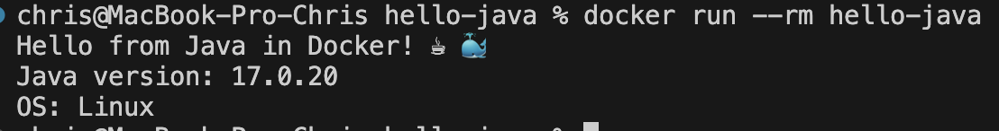

# Java CI/CD Pipeline App

Учебный проект для демонстрации настройки CI/CD для приложения на **Java** с использованием **GitHub Actions**, **Maven** и **Docker**.

## Описание проекта
Приложение включает базовый класс `Hello.java`, покрытый тестами на базе `JUnit 5`. Проект настроен на сборку «толстого» JAR-файла (fat JAR) с помощью `maven-shade-plugin`.

## Функционал CI/CD
Пайплайн настроен в `.github/workflows/ci.yml` и выполняет:
1. **Подготовку JDK 17:** Установка Java (Temurin) с кэшированием зависимостей Maven.
2. **Сборку и тестирование:** Выполнение фаз `mvn clean verify`.
3. **Multistage Docker-сборку:** Упаковку скомпилированного JAR-файла в минималистичный образ на базе JRE-alpine.

## Локальный запуск
#

Сборка проекта в Docker-образ:
```bash
docker build -t hello-java .